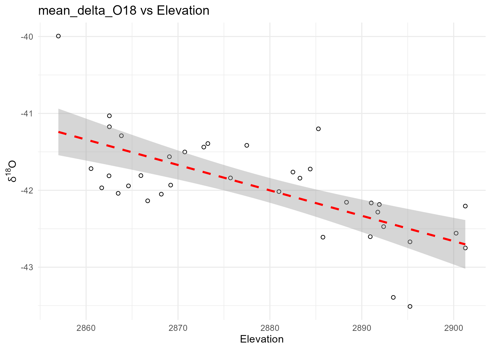
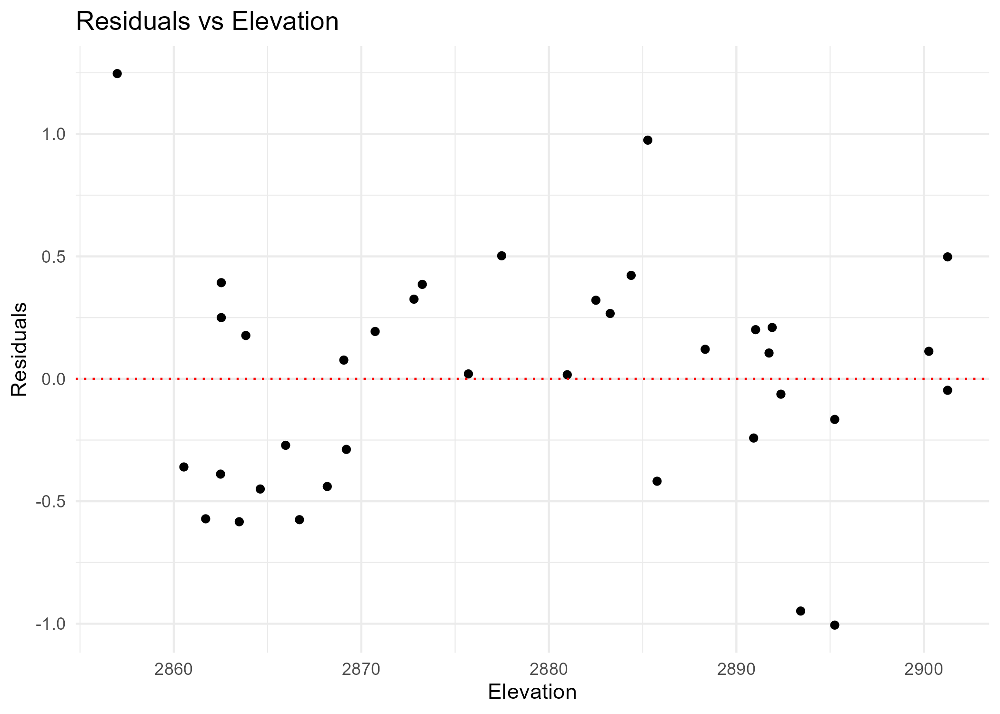
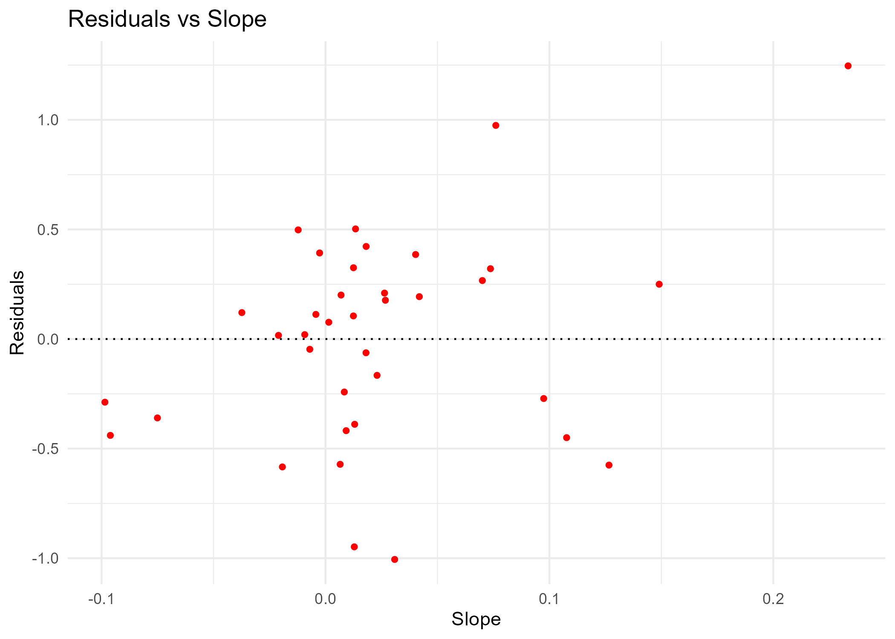
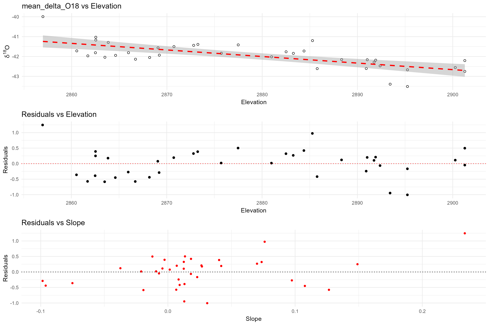

# 🧪 Isotope-Elevation Analysis

This project analyzes the relationship between oxygen isotope values (δ¹⁸O), elevation, and slope using linear regression modeling and residual diagnostics.

---

## 📁 Project Structure

```
isotope-elevation-analysis/
├── data/
│   └── isotope_data_with_slope.csv
├── scripts/
│   └── isotope_analysis.R
├── plots/
│   ├── plot1_mean_delta_O18_vs_Elevation.png
│   ├── plot2_residuals_vs_elevation.png
│   ├── plot3_residuals_vs_slope.png
│   └── plot_combined_grid.png
└── README.md
```

---

## 📊 Key Analyses

- **Linear Regression**: δ¹⁸O as a function of elevation
- **Residual Analysis**: Diagnostic plots for model fit
- **Correlation Tests**:
  - δ¹⁸O vs Elevation
  - Residuals vs Elevation and Slope
  - Predicted δ¹⁸O vs Elevation and Slope

---

## 🖼️ Visualizations

### δ¹⁸O vs Elevation  


### Residuals vs Elevation  


### Residuals vs Slope  


### Combined Grid of All Plots  


---

## 🧠 How to Reproduce

1. Clone the repository.
2. Ensure R is installed.
3. Install required libraries:

```r
install.packages(c("ggplot2", "dplyr", "gridExtra"))
```

4. Run the script:

```r
source("scripts/isotope_analysis.R")
```

---

## 👨‍💻 Author

**Atifa Elmasry**  
Environmental Data Analyst | R Programming | Geospatial Analysis

---

## 📄 License

This project is open-source and available under the [MIT License](LICENSE).
